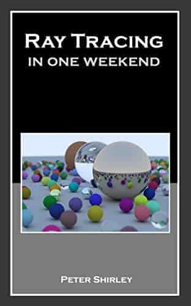

# Ray Tracing in One Weekend



## 简介

本项目是对 [Ray Tracing in One Weekend](http://www.realtimerendering.com/raytracing/Ray%20Tracing%20in%20a%20Weekend.pdf) 的重构。

笔记为 [notes](notes.md) 

因为 GitHub 不支持公式，推荐用 [Typora](https://www.typora.io/) 查看 md 文件。

程序生成的图片格式为 PPM，可用[格式工厂](http://www.pcfreetime.com/formatfactory/CN/index.html)将其转换为 PNG 格式后再查看。

## 环境

### Windows

- VS 2017
- [CMake](https://cmake.org/) 3.1 以上

### Linux

- C++11
- [CMake](https://cmake.org/) 3.1 以上

## 安装

### Windows

搭建工程

```bash
mkdir build
cd build
cmake ..
start RayTracingInOneWeekend.sln
```

或者直接运行 `setup.bat` 

打开 VS 后

在解决方案中，右键 `CMakePredefinedTargets/INSTALL`，点击“生成”，各种 exe 就会安装在 `bin/` 中了。

### Linux

```shell
mkdir build
cd build
cmake ..
make
make install
```

这样所有的程序都在 `bin/` 中，执行这些程序，输出结果在 `data/` 中

