# 01. 输出图像

我们需要图像文件来存储渲染结果，有很多种图片格式，PPM 是其中的一种简单格式。

> 示例
>
> ```python
> P3 # 格式
> 3 2 # 3 列 2 行
> 255 # 255 是最大值
> 255   0   0 # 红
>   0 255   0 # 绿
>   0   0 255 # 蓝
> 255 255   0 # 黄
> 255 255 255 # 白
>   0   0   0 # 黑
> ```
>
> 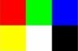
>
> 从上至下，从左至右

我们尝试生成一个 PPM 格式的图像，从下至上绿色加深，从左至右红色加深

渲染结果如下

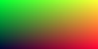

完整实现代码为 [src/01/main.cpp](src/01/main.cpp)。

# 02. Vec3

图形程序需要处理几何向量和颜色。一般用 4D 向量（齐次坐标，RGBA）。本教程用 3D 就足够了。

将接口分为几类功能

- 元素访问
- 线性插值
- 线性运算：向量加减，数乘
- 内积
- 范数
- 逐元素相乘
- 叉乘

使用了 `union` 来方便元素获取

```c++
union {
    struct { T x, y, z; };
    struct { T r, g, b; };
    struct { T _data[3]; };
};
```

详细实现为 [include/Vec3.h](include/Vec3.h)。

我们可以用 `Vec3` 来优化[上一节](#C01. 输出图像)的[代码](src/01/main.cpp)，优化后为 [src/02/main.cpp](src/02/main.cpp)。

# 03. 光线、相机、背景 Ray, Camera, Background

光线可以表示为 $\mathbf{p}(t)=\mathbf{o}+t\mathbf{d}$，示意图如下

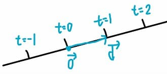

详细实现为 [include/Ray.h](include/Ray.h)。其中，为了简化设计，我们用 `tMin` 和 `tMax` 来描述光线的范围。

光线追踪的核心是从相机（观察点）发射光线，追踪这些光线，计算出光线相应的颜色。

> 光是从光源出发，经过多次散射，最终到达相机。我们的计算过程与此相反，故称为光线追踪。

根据习惯原因，空间坐标系为**右手系**。

为了简化，我们将相机放在原点，右方向为 x 轴，上方向为 y 轴，相机看向 -z 方向。

> 直观解释
>
> 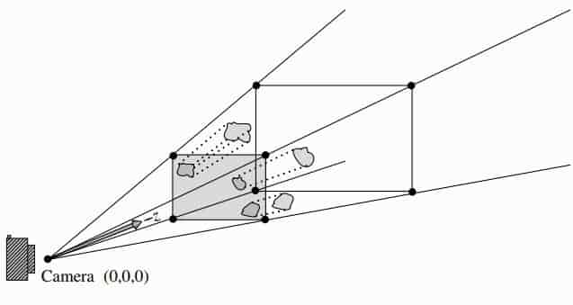
>
> 相机拍摄时，物体相当于投影在了一个虚拟的成像平面（图中灰色平面）上。
>
> 我们将电脑的显示屏幕视为该成像平面（脑子里想象下图的显示器就是上图的成像平面，而人就是相机）
>
> 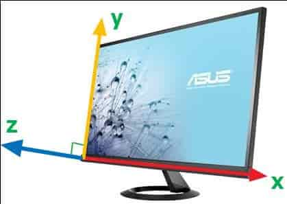
>
> 右方向为 x 轴，上方向为 y 轴。
>
> 根据右手系，垂直屏幕朝向外侧的是 z 轴，画面中的场景在屏幕内侧，即为 -z 侧。
>
> 因此相机习惯上定义为看向 -z 方向。

假设成像平面的宽高比为 2 : 1，成像平面放在距离 1 的位置。则有

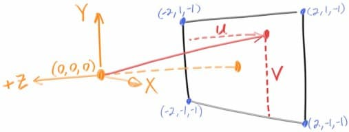

根据几何关系，我们可以用参数坐标 (u, v) 定位成像平面上的一点，并确定一条光线。

> 简单推导下 (u, v) 与成像平面上一点的关系
>
> 左下角坐标为 `lowerLeft = (-2, -1, -1)` 
>
> 水平方向为 `horizontal = (4, 0, 0)` 
>
> 竖直方向为 `verticle = (0, 2, 0)` 
>
> 屏幕上的点为 `target = lowerLeft + u * horizontal + v * verticle` 

有了光线后，我们要计算光线相应的颜色。现在场景还是空的，光线发出后不会与物体相交。我们先设置一个背景色，给那些没有相交的光线确定一个颜色值。颜色简单实现为蓝色和白色的**线性插值**。

$$
\text{color}(t) = t*\text{white} + (1-t)*\text{blue}
$$

代码为

```c++
const Vec3f Sky(const Ray & ray) {
	auto normDir = ray.d.Normalize();
	float t = 0.5f * (normDir.y + 1.0f); // 将法向的范围映射到 [0, 1] 以可视化

	const Vec3f white(1.f);
	const Vec3f blue(0.5, 0.7, 1);

	return Vec3f::Lerp(white, blue, t); // 线性插值
}
```

渲染结果为


完整实现代码为 [src/03/main.cpp](src/03/main.cpp)。

# 04. 球 Sphere

球可以用球心和半径表示，公式为

$$
(\mathbf{p}-\mathbf{c})^2=R^2
$$

我们要做光线与球的相交计算，将光线方程 $\mathbf{p}(t)=\mathbf{o}+t\mathbf{d}$ 代入上式，有

$$
\begin{aligned}
(\mathbf{o}+t\mathbf{d}-\mathbf{c})^2 &= R^2\\
\mathbf{d}^2t^2+2\left(\mathbf{d}\cdot(\mathbf{o}-\mathbf{c})\right)t+(\mathbf{o}-\mathbf{c})^2-R^2 &= 0\\
\end{aligned}
$$

这是一个关于 t 的二元一次方程，判别式为

$$
\Delta = 4\left(\mathbf{d}\cdot(\mathbf{o}-\mathbf{c})\right)^2-4\mathbf{d}^2\left((\mathbf{o}-\mathbf{c})^2-R^2\right)
$$

判别式决定了根的个数


我们在场景中放一个球，球心位置为 (0, 0, -1)，半径为 0.5，如果光线与球相交，则返回红色。

相应的光线追踪逻辑为

```c++
const Vec3f Trace(const Ray & ray) {
	if (Hit_Sphere({ 0,0,-1 }, 0.5f, ray))
		return { 1,0,0 };

	return Sky(ray);
}
```

渲染结果为

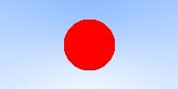


完整实现代码为 [src/04/main.cpp](src/04/main.cpp)。

# 05. 表面法向、物体 Surface normals, objects

表面法向是一个很重要的物理量，**垂直于物体表面**，朝向**外侧**。在后续的光线散射计算中要用到。

对于球，法向很简单求得

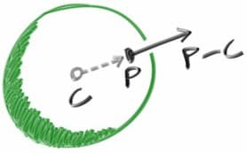

再除以半径就可以得到**单位法向**了（单位向量是长度为 1 的向量）。

一般用**树形**结构来组织场景，树的结点基类，命名为 `Hitable`，实现了接口 `Hit()`，因此得名。

> 取名的选择是很多的，比如 node，GameObject，object 等

接口 `Hit()` 接受输入 `ray`，输出结果放在 `HitRecord` 中，包含了碰撞点 `p` 和单位法向 `n`。之前提到，为了简化设计，我们用 `tMin` 和 `tMax` 确定了光线的范围，所以 `Hit()` 不需要这些参数。此外 `Hit()` 会直接修改 `ray` 的 `tMax`，使其一直记录着（当前计算到的）最近相交点对应的 t。

[上一节](#C04. 球 Sphere)的球 `Sphere` 继承于 `Hitable`，实现了 `Hit()` 接口，详细可见 [include/Sphere.h](include/Sphere.h)。

为了实现**树形**的组织，我们需要一个结点类型，它含有多个孩子结点。实现中其为 `HitableList`，实现了 `Hit()` 方法，如下

```c++
bool HitableList::Hit(Ray & ray, HitRecord & rec) const {
	bool isHit = false;
	for (auto hitable : hitables) {
		if (hitable->Hit(ray, rec))
			isHit = true;
	}
	return isHit;
}
```

详细实现为 [include/HitableList.h](include/HitableList.h)。

此外，C++11 引入了一种**智能指针** `std::shared_ptr` ，树形结构就很适合使用该智能指针（父节点销毁时，子节点也会自动递归销毁）。此外，用 `using` 语句将其简写成了 `Ptr<T>`，详细请看 [include/Ptr.h](include/Ptr.h)。

根据 *Effetive Modern C++* 建议，我们使用 `std::make_shared` 来生成智能指针。但 `std::make_shared` 是模板函数，出错误时编译器会吐出一大堆错误，很是烦人。因此，我在类中实现了静态方法 `New`，规避此问题。

现在我们可以组织场景了，如下

```c++
auto sphere = Sphere::New({ 0, 0, -1 }, 0.5f);
auto ground = Sphere::New({ 0, -100.5, -1 }, 100.f);
auto scene = HitableList::New({ sphere,ground });
```

> 一个大球用来模拟地面，一个小球放在中心，然后两者放在一个 `HitableList` 里

光线追踪的逻辑现在为

```c++
const Vec3f Trace(Ptr<Hitable> scene, Ray & ray) {
	HitRecord rec;
	if (scene->Hit(ray, rec))
		return 0.5f * (rec.n + Vec3f(1.f)); // 映射到 0 - 1

	return Sky(ray);
}
```

渲染结果为

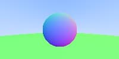

完整实现代码为 [src/05/main.cpp](src/05/main.cpp)。

# 06. 抗锯齿 Antialiasing

图像文件是离散的，场景是连续的。一个像素只用一个光线来计算颜色，很容易就引入了锯齿。

我们可以在一个像素内，使用多条光线来计算颜色，最后取平均即可，能有效缓解锯齿问题。

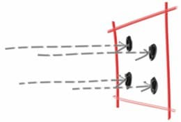

每个像素采样 100 次，效果为

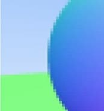

完整实现代码为 [src/06/main.cpp](src/06/main.cpp)。

# 07. 漫反射材质 Diffuse Material

现在给物体加上材质，用于描述光线与表面的交互。光线到达表面后，可能会重新射出。对于**漫反射材质**，光线射出方向随机；对于**镜面**材质，出射方向遵循**反射**规律；对于玻璃、水等**电介质**，光线会发生**折射**。同时，光线也会被**吸收**或**衰减**。

先来考虑漫反射，其射出方向用以下方式确定

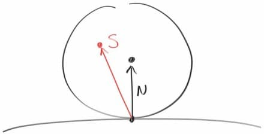

其中 S 在 N 的单位球（半径为 1）内。

在单位球内随机采样可以用简单的拒绝法来实现，如下

```c++
// [0, 1)
const Vec3f RandInSphere() {
    Vec3f p;
    do {
        p = 2.0*Vec3f(RandF(), RandF(), RandF()) - Vec3f(1.f); // RandF() 返回 [0, 1) 随机浮点数
    } while (p.Norm2() >= 1.f);

    return p;
}
```

我们现在只有一种材质，直接将其写在渲染逻辑里边，假设每次反射，光照衰减一半，实现如下

```c++
const Vec3f Trace(Ptr<Hitable> scene, Ray & ray) {
    HitRecord rec;
    if (scene->Hit(ray, rec)) {
        Vec3f dir = rec.n + Util::RandInSphere(); // 漫反射
        Ray newRay(rec.p, dir.Normalize());
        return 0.5f * Trace(scene, newRay); // 光照衰减一半
    }

    return Sky(ray);
}
```

渲染结果为

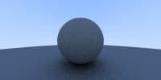

会发现比较暗，但反射率 0.5 不应该这么暗。实际上，这涉及到了 Gamma 机制。

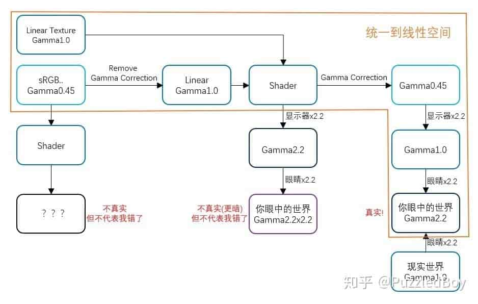

现实世界光照效果是线性的，人眼会将光照颜色乘以 2.2 次方，显示器也会将颜色乘以 2.2 次方。如果我们提供给显示器的光照颜色是线性的，那么经过显示器和人眼，颜色就乘了 2 遍 2.2 次方，所以偏暗了。为了解决这个问题，我们会将颜色先开 2.2 次方，称为 Gamma 校正 Gamma Correction。

Gamma 校正后，渲染结果为

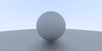

这效果就比较正常了。

此外，反射后的部分光线，由于浮点数的精度误差，可能再次与原表面相交，称为 shadow acne problem。我们可以通过将光线偏移一小些距离以避免该问题，因此我们给 `Ray` 的 `tMin` 设置为 `0.001`。

完整实现代码为 [src/07/main.cpp](src/07/main.cpp)。

# 08. 金属 Metal

不止漫反射这一种材质，还有金属、电介质（如玻璃、水）等。

因此从设计角度，我们可以为材质设计一个基类 `Material`，含有接口 `Scatter()`，用于描述光线与表面的交互

```c++
class Material {
public:
	virtual const ScatterRst Scatter(const Ray & ray, const HitRecord & rec) const = 0;
};
```

其中 `ScatterRst` 用于记录结果，包含了新的光线 `ray` 和衰减 `attenuation`。

我们可以为之前的漫反射实现为类 `Lambertian`，继承于 `Material`。接口实现为

```c++
const ScatterRst Lambertian::Scatter(const Ray & ray, const HitRecord & rec) const {
	Vec3f dir = rec.n + Util::RandInSphere();
	Ray scatterRay(rec.p, dir.Normalize());
	return ScatterRst(true, scatterRay, albedo);
}
```

详细实现为 [include/Lambertian.h](include/Lambertian.h)。

我们再来看金属材质，其遵循简单的反射规律

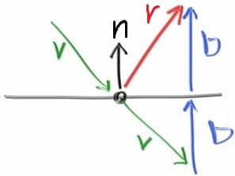

公式为

$$
\begin{aligned}
\mathbf{b}&=-(\mathbf{v}\cdot\mathbf{n})\mathbf{n}\\
\mathbf{r}&=\mathbf{v}+2\mathbf{b}=\mathbf{v}-2(\mathbf{v}\cdot\mathbf{n})\mathbf{n}\\
\end{aligned}
$$

实现代码即为

```c++
// I 朝向表面，N 朝向表面外侧
// I 和 N 无需是单位向量
// 反射方向的长度等于 I
const Vec3f Reflect(const Vec3f & I, const Vec3f & N) {
    float IoN = I.Dot(N);
    return I - 2.f * IoN * N;
}
```

为了模拟粗糙的金属表面，我们可以简单地给反射方向引入一个随机偏移

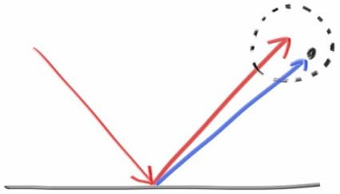

球的半径为 `fuzz`。如果偏移后，反射方向到了表面内侧，就将其视为光线被吸收了。

`Metal` 的 `Scatter()` 为

```c++
const ScatterRst Metal::Scatter(const Ray & ray, const HitRecord & rec) const {
	Vec3f dir = Util::Reflect(ray.d.Normalize(), rec.n) + fuzz * Util::RandInSphere();
	if (dir.Dot(rec.n) <= 0) // 表面内侧
		return ScatterRst::InValid();

	Ray newRay(rec.p, dir);
	return ScatterRst(true, newRay, albedo);
}
```

详细实现为 [include/Metal.h](include/Metal.h)。

引入材质后，渲染逻辑变更为

```c++
const Vec3f Trace(Ptr<Hitable> scene, Ray & ray, int depth) {
	HitRecord rec;
	if (scene->Hit(ray, rec)) {
		if (depth >= 50) // 过深则停止追踪
			return Vec3f(0.f);

		auto scatterRst = rec.material->Scatter(ray, rec);
		if (!scatterRst.isScatter) // 光线被完全吸收
			return Vec3f(0.f);

		return scatterRst.attenuation * Trace(scene, scatterRst.ray, depth + 1); // 递归求解
	}

	return Sky(ray);
}
```

我们测试一下新的材质，渲染效果如下（左球的 `fuzz` 为 0.3，右边的 `fuzz` 为 1.0）

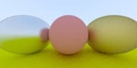

完整的实现代码为 [src/08/main.cpp](src/08/main.cpp)。

# 09. 电介质 Dieletrics

电介质包括玻璃、水等，有折射效果。折射遵循 Snell 定律。

折射相关的公式详细推导如下

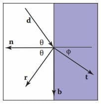

Snell 定律为

$$
\eta_i\sin\theta=\eta_t\sin\phi
$$

其中 $\eta_i$ 和 $\eta_t$ 是入射侧和折射侧的折射率。

根据三角函数的关系，两边平方，可推得
$$
\cos^2\phi=1-\frac{\eta_i^2(1-\cos^2\theta)}{\eta_t^2}
$$

根据几何关系，有

$$
\mathbf{t}=\mathbf{b}\sin\phi-\mathbf{n}\cos\phi\\
\mathbf{d}=\mathbf{b}\sin\theta-\mathbf{n}\cos\theta\\
\mathbf{b}=\frac{\mathbf{d}+\mathbf{n}\cos\theta}{\sin\theta}
$$

结合起来可得

$$
\begin{align*}
\mathbf{t}&=\frac{\eta_i(\mathbf{d}+\mathbf{n}\cos\theta)}{\eta_t}-\mathbf{n}\cos\phi\\
&=\frac{\eta_i(\mathbf{d}+\mathbf{n}(-\mathbf{d}\cdot\mathbf{n}))}{\eta_t}-\mathbf{n}\sqrt{1-\frac{\eta_i^2(1-(\mathbf{d}\cdot\mathbf{n})^2)}{\eta_t^2}}\\
\end{align*}
$$

当根号下的值为负数时发生**全反射**。

折射的实现为

```c++
// I 和 N 是单位向量
// I 朝向表面，N 朝向表面外侧
// 发生全反射时，返回 false，否则返回 true
const bool Refract(const Vec3f & I, Vec3f N, float ior, Vec3f & T) {
    float etai_etat; // 入射侧折射率 除以 折射侧折射率
    float IoN = I.Dot(N);
    bool isEntering = IoN < 0;
    if (!isEntering) {
        // 射出
    
        // 让 N 在 I 这一侧
        N = -N;
        IoN = -IoN;
    
        etai_etat = ior; // etai = ior, etat = 1
    }
    else
        etai_etat = 1.f / ior; // etai = 1, etat = ior
    
    float discriminant = 1.f - etai_etat * etai_etat * (1.f - IoN * IoN);
    if (discriminant <= 0) // 全反射
        return false;
    
    T = etai_etat * (I - IoN * N) - sqrt(discriminant) * N;
    return true;
}
```

折射的同时会有**反射**，反射率遵循 Fresnel equations，称为**菲涅尔系数**。反射率比较难算，一个常用的近似公式 Schlick approximation 为

$$
F(\theta)=F_0+(1-F_0)(1-\cos\theta)^5\\
F_0=(\frac{\eta-1}{\eta+1})^2
$$

其中 $\eta$ 是两侧介质**折射率的较大者**，$\theta$ 是**低折射率侧**的向量与法向的夹角。

最终 `Dielectric` 的 `Scatter()` 实现为

```c++
const ScatterRst Dielectric::Scatter(const Ray & ray, const HitRecord & rec) const {
	Vec3f I = ray.d.Normalize();

	Vec3f T; // 折射方向
	if (!Util::Refract(I, rec.n, ior, T)) {
		// 全反射
		Vec3f dir = Util::Reflect(I, rec.n);
		return ScatterRst(true, { rec.p, dir }, Vec3f(1.f));
	}

	float IoN = I.Dot(rec.n);
	bool isEntering = IoN < 0;
	// 必须是空气中的方向与法向的夹角的余弦
	float cosTheta = isEntering ? -I.Dot(rec.n) : T.Dot(rec.n);
	float F = Util::Fresnel_Schlick(ior, cosTheta); // 菲涅尔系数，即反射概率

	if (Util::RandF() < F) {
		// 反射
		Vec3f dir = Util::Reflect(I, rec.n);
		return ScatterRst(true, { rec.p, dir }, Vec3f(1.f));
	}

	// 折射
	return ScatterRst(true, { rec.p, T }, Vec3f(1.f));
}
```

测试一下该材质，渲染结果如下

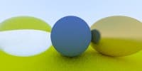

有一个小技巧，就是用一个半径为负的玻璃球放在上图玻璃球内部，就可以实现中空玻璃球的效果，渲染结果如下

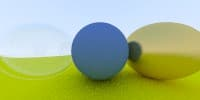

测试代码为 [src/09/main.cpp](src/09/main.cpp)。

# 10. 可定位相机 Positionable Camera

之前使用的相机很简单，现在考虑对其进行封装。

相机包含了许多参数。首先是视域 field of view FOV，常用纵向视域 verticle FOV `vfov`，表示纵向的视线范围的张角。

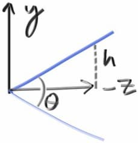

假设成像平面距离为 1（[下一节](#11. 散焦模糊 Defocus Blur) 会引入 `focusDis` 表示此距离），则成像平面高度为 $h=\tan(\theta/2)$。

还包括参数宽高比 aspect ratio，由此可计算得成像平面宽度为 `w = aspect * h`。

相机的位置和朝向可以用位置 `lookfrom` 和视点 `lookat` 确定

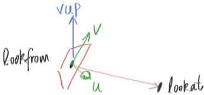

相机的前方向 `front = (lookat-lookfrom).Normalize()`。

我们还需要确定成像平面的水平和竖直方向，也就是相机的上方向 `up` 和 `right`。计算他们需要一个辅助的世界上方向 `worldUp`，一般为 `(0, 1, 0)`。

根据几何关系有

$$
\begin{aligned}
\text{right} &= \text{front} \times \text{worldUp}\\
\text{up} &= \text{right} \times \text{front}\\
\end{aligned}
$$

我们可以会用参数坐标 (u, v) 获得成像平面上的点，从而确定一条光线，详细实现为 [include/Camera.h](include/Camera.h)。

代码中含有下节才提到的 `focusDis` 和 `apeture`，当 `focusDis == 1` 且 `apeture == 0` 时相机模型退化成本节模型，即针孔相机。

对[上一节](#09. 电介质 Dieletrics)的场景，我们改变下相机的参数，渲染结果为


测试代码为 [src/10/main.cpp](src/10/main.cpp)。


# 11. 散焦模糊 Defocus Blur

真实的相机，透镜并不是一个点，而是有大小的。由此会引入景深的概念。物体在某些位置会很清晰，偏离此位置就变得模糊，该位置与相机的距离称为对焦距离 focus distance，该位置称为对焦平面 focus plane。

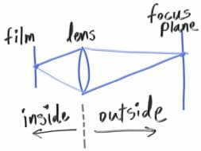

透镜建模为一个圆盘，直径为 `apeture`。

透镜上随机一点与成像平面一点就可以确定一条光线。当 `apeture` 为 0 时，该相机模型就退化为[上一节](#10. 可定位相机 Positionable Camera)的模型，针孔相机。

对焦距离就是成像平面与相机的距离，这样，成像平面的高度和宽度都会扩大 `focusDis` 倍。

相机的详细实现为 [include/Camera.h](include/Camera.h)。

我们测试一下，渲染结果为

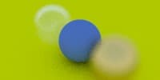

可以看到，蓝色球很清晰，其他球就模糊了

测试代码为 [src/11/main.cpp](src/11/main.cpp)。

# 12. 下一步

测试代码为 [src/12/main.cpp](src/12/main.cpp)，渲染结果为

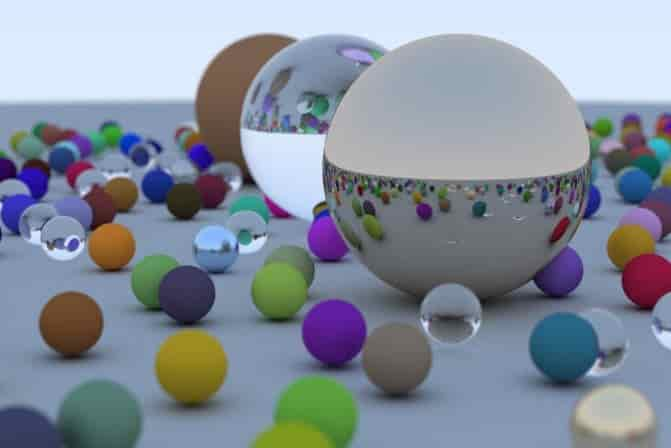

接下来还有很多可以实现，包括

- 光源：点光源、面光源、聚光灯、方向光
- 三角网格
- 纹理
- 体积、介质
- 并行

加油！

# 13. 并行

CPU 有多个核心，为了都利用上，可以使用多线程。渲染可以很好地进行并行化，最简单的方式就是将 `width * height` 个像素的计算任务平均分给多个线程。

首先要获取 CPU 的核心数，为了同时支持 Windows 和 Linux，使用了预处理指令 `#ifdef` 等。

```c++
// 用于获取 CPU 核心数
#ifdef WIN32
#include <windows.h>
#elif defined(__linux__)
#include <unistd.h>
#else
#error not support system
#endif

// 获取 CPU 的逻辑核心数
int NumCPU() {
    // 根据不同的系统选择对应的实现
#ifdef WIN32
    SYSTEM_INFO info;
    GetSystemInfo(&info);
    return static_cast<int>(info.dwNumberOfProcessors);
#elif defined(__linux__)
    int cpu_num = sysconf(_SC_NPROCESSORS_ONLN);
    return cpu_num;
#else
#error not support system
#endif
}
```

接下来可以用 `std::thread` 来实现多线程。

测试代码为 [src/13/main.cpp](src/13/main.cpp)。相比[第 12 节](#12. 下一步)，提速了几倍。

# 14. 加速结构

[第 12 节](#12. 下一步) 中的场景含有大量的小球，每次相交都要对所有的小球进行相交判断，时间复杂度为 $O(n)$。

考虑先计算出一个包围盒， 将所有的小球都放在内部。

这样如果射线与该盒子不相交（如下图实线射线），则可直接知道射线与所有小球都不相交。

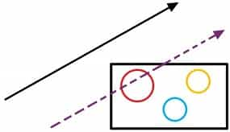

如果射线与盒子相交的话（如上图虚线射线），我们又要对所有小球进行相交判断了。

我们可以再对盒子中的所有小球划分成两部分，各部分又对应着一个包围盒。这样我们又能继续与盒子进行相交判断了。

递归地对整个场景划分，就得到了一棵二叉盒子树，称为 bounding volume hierarchy (BVH)

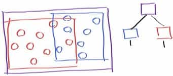

这样我们在相交运算过程中，经常因为与盒子不相交就能直接省去盒子内所有物体的相交运算，这样算法复杂度大概为 $O(\log n)$。

首先我们封装一个盒子类 `Box`，由最小点 `minP` 和最大点 `maxP` 定义。核心函数是 `Hit()`，计算射线与盒子的相交。

射线与盒子的计算原理一句话概括就是求每个维度的相交范围的交集。同时也要与射线的范围 `tMin ~ tMax` 求交集，如果交集为空，则不相交，否则相交，并返回相交范围 `t0 ~ t1` 。

`Box` 的详细实现请看 [include/Box.h](include/Box.h)。

接下来我们给 `Hitable` 类新增接口 `GetBox()`。`Sphere` 和 `HitableList` 的包围盒计算较为简单，详细实现请查看 [include/Sphere.h](include/Sphere.h) 和 [include/HitableList.h](include/HitableList.h)。

我们为 BVH 中的一个节点也封装一个类 `NodeBVH`，`Hit()` 的详细实现请看 [include/NodeBVH.h](include/NodeBVH.h)。

当射线同时击中左盒和右盒时，我们先对盒子靠前的子节点进行相交运算。如果与靠前子节点发生了碰撞，那么 `ray.tMax` 会被更新，利用此对靠后盒子在进行以此交集判断，如果变成与盒子不相交了，就能省去与其节点的相交运算。

`NodeBVH` 如果是叶节点，就将 `left` 和 `right` 都指向同一 `hitable` 即可。这样这个 BVH 中不存在空节点 `nullptr`。

接下来的问题就是该如何构建这个 BVH 了。方法有很多，我们实现一种较为简单的方法。

我们依据 `Hitable` 的 `Box` 的中心进行划分。每次划分会挑选一个轴，然后根据中心在该轴上的均值将 `hitables` 分成两部分。所选的轴是方差最大的轴。详细实现请查看 [include/NodeBVH.h](include/NodeBVH.h)。

测试代码为 [src/14/main.cpp](src/14/main.cpp)。相比[第 13 节](#13. 并行)，速度可再提升几倍。

# 15. 体积 Volume

我们来渲染雾效，雾可以将其视为一大堆微小的粒子组成的物体。光线进入其中会发生随机的散射， 满足规律
$$
\mathbf{d}P = C\mathbf{d}L
$$
一个微元距离 $\mathbf{d}L$ 后，光线发生散射的概率为 $\mathbf{d}P$。

一段距离 L 后不发生散射的概率为
$$
P=\lim\limits_{n\to\infty}(1-C\frac{L}{n})^n=e^{-CL}
$$
则有
$$
L=-\frac{\ln P}{C}
$$
在 [0, 1] 上均匀采样 P，则可得到相应的 L。

我们将这类物体封装为 `Volume`，其中的 `boundary` 定义了范围，具体实现为 [include/Volume.h](include/Volume.h)。

碰撞后会发生随机的散射，这类材质我们将其封装为 `Isotropy`，具体实现为 [include/Isotropy.h](include/Isotropy.h)。

测试代码为 [src/15/main.cpp](src/15/main.cpp)，渲染结果如下

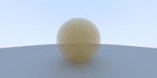

# 16. 光源 Light

之前我们一直用背景来打光，现在我们来实现一个简单的光源。

我们将光源视为一种材质，它能发光，不散射光。为此，我们给 `Material` 新增一个接口 `emit()`，默认返回 `Vec3f(0)`。对于光源，`emit()` 返回光的发光值 `L`。详细的实现为 [include/Light.h](include/Light.h)。

新增了 `emit()` 后，渲染逻辑相应更改为

```c++
const Vec3f Trace(Ptr<Hitable> scene, Ray & ray, int depth) {
	HitRecord rec;
	if (scene->Hit(ray, rec)) {
		if (depth >= 50)
			return 0;

		auto scatterRst = rec.material->Scatter(ray, rec);
		if (!scatterRst.isScatter)
			return rec.material->Emit();

		return rec.material->Emit() + scatterRst.attenuation * Trace(scene, scatterRst.ray, depth + 1);
	}

	// return Sky(ray); 去除背景
	return 0;
}
```

测试代码为 [src/16/main.cpp](src/16/main.cpp)，渲染结果为

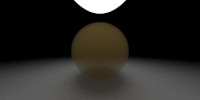

